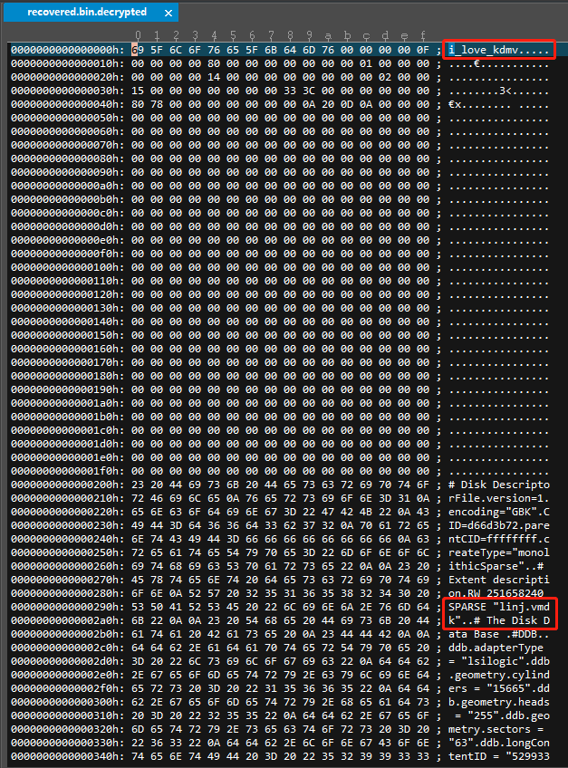
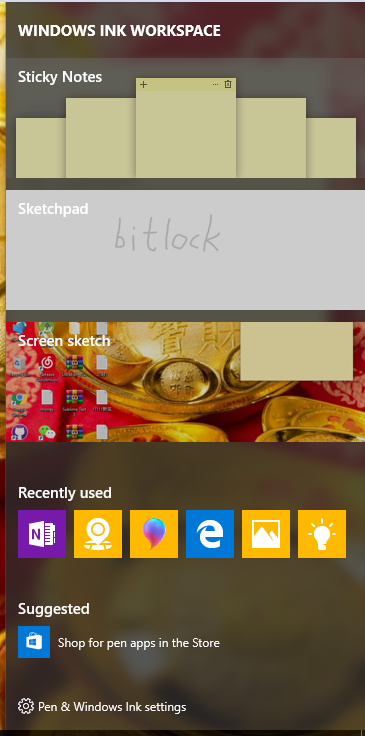
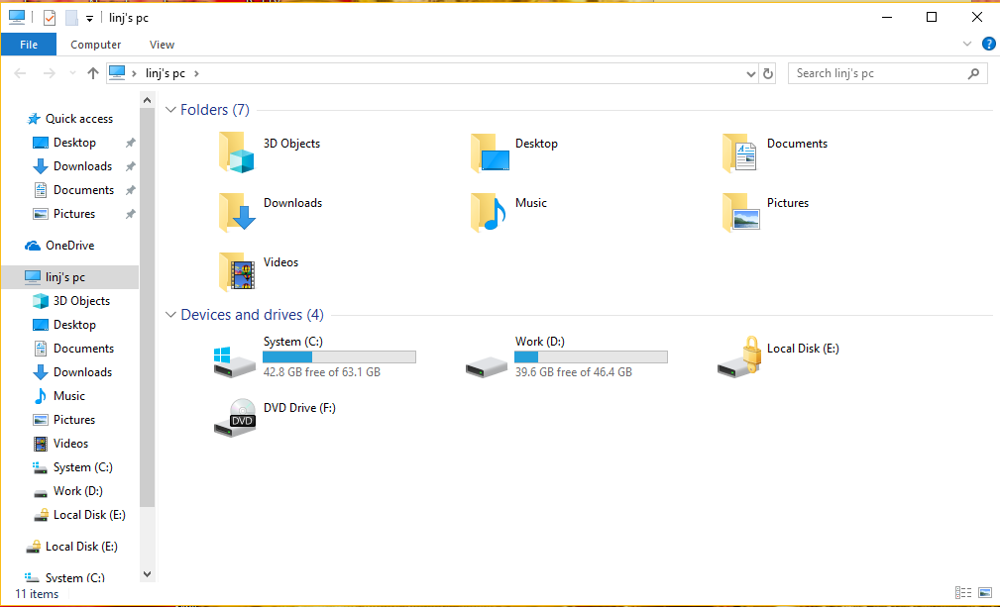
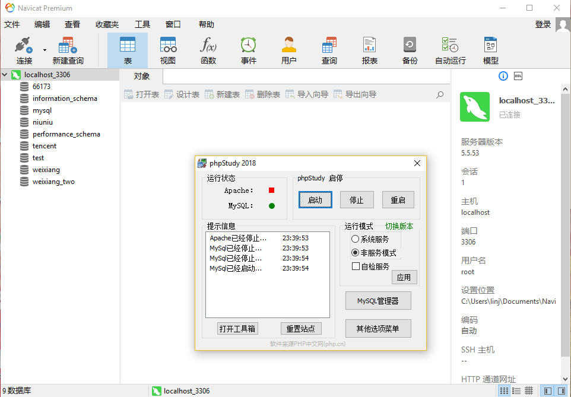
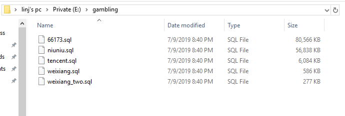
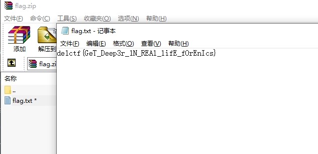

[中文](./readme_zh.md) [English](./readme.md)

题目附件下载链接（未来可能会失效）：

[deepinreal](https://share.weiyun.com/5JMqJdT) (weiyun)

[deepinreal](https://pan.baidu.com/s/1O-A-lbRRADLYqK0y9UDX-w) (baiduyun)

[deepinreal](https://drive.google.com/drive/folders/1qrSPaE1V39a4W3yP8lXHfXAX_SuOIbYk) (google drive)

[deepinreal](https://mega.nz/#F!SiInRaKA!SBtuAQrevLcjO823h1tnPg) (mega)

[deepinreal](http://222.85.25.40/deepinreal/) (mycloud)

# DeepInReal WriteUp

压缩包解压得到三个文件。


先看 `from-officer.txt`。


大概意思是说，这个二进制文件是从嫌疑人的移动硬盘里恢复出来的，是一个 `AES-256` 加密文件，解密的密钥是世界上最常用和最弱的。

根据 `officer` 的提示，我们可以上网查一下世界上最常用和最弱的密码是什么。


根据维基百科的记录， 2019 年最常用的密码排在第一位的是 `123456` 。

那么我们用题目所提供的加解密软件 `WinAES` 和密钥 `123456` 即可解密 `recovered.bin` 文件。


得到解密文件 `recovered.bin.decrypted`，很自然地想查看文件类型，就去查看一下文件的头部。



这个文件原名叫 `linj.vmdk`，是一个 `vmdk` 映像文件。它的文件头部被修改过，我们可以参照其它 `vmdk` 格式的文件头部，把头部改回正常。


这时候就是一个正常的 `vmdk` 文件了。我们可以使用 `开源取证工具` 或者 `商业取证工具` 进行 静态取证，也可以使用 `专业仿真软件` 或者 `VMware` 进行 `动态取证`。

我这里使用 `取证大师` 进行 `静态取证`，使用 `VMware` 进行 `动态取证`。

在 `VMware` 中加载这个镜像文件，开机后登录系统需要密码，密码提示 `headers` 。

刚才我们在文件头处看到了 `i_love_kdmv`，这个就是系统登录的密码。


登录后，在桌面右上角看到一张便签，大概意思是，“你不应该到这里来，我已经删除了一条重要的钥匙，怎么找到我？”。

这里的“我”指的是“便签”。嫌疑人很可能使用系统自带的功能进行信息的隐藏。我们可以先找到 `windows 10` 下创建标签的方式，就是按下 `win+w` 键。



从右边弹出的侧菜单栏可以看到，`sketchpad` 功能处写着 `bitlock`，点进去看看。


可以看到 `bitlocker` 的密码，`linj920623!@#`，系统中确实存在一个 `bitlocker` 的加密盘。



使用密码进行解密，可以成功解开加密盘。


加密盘里有两个值得留意的文件。


一个是数字货币加密钱包文件，另一个是密码字典。这可能是嫌疑人用来进行资金流通的数字货币钱包。

我们尝试写个脚本，使用密码字典对加密钱包文件进行暴力破解。

```
import eth_keyfile
import json

fp = open('ethpass.dict', 'r')
wallet = json.loads(open('UTC--2019-07-09T21-31-39.077Z--266ed8970d4713e8f2701cbe137bda2711b78d57', 'r').read())

while True:
    try:
        password = fp.readline().strip().encode('ascii')
        if len(password) <= 0 :
            print("password not found")
            break
    except:
        continue
    try:
        result = eth_keyfile.decode_keyfile_json(wallet, password)
    except:
        continue
    print(password)
    print(result)
    break
```


暴力破解可以得到结果，加密钱包密码为 `nevada`，钱包私钥为 `VeraCrypt Pass: V3Ra1sSe3ure2333`。

私钥提示我们有一个 `VeraCrypt` 加密的容器，它的加密密码为 `V3Ra1sSe3ure2333`。

那么我们需要先找到这个容器文件。这里可以使用全盘搜索包含特定字串的方法，找到这个加密容器文件。我这里使用 `取证大师` 进行取证，直接在 `加密文件` 处可以找到这个文件。


可是在 `VMware` 相对应的路径下找不到这个文件，想起便签处的提示，可能在系统加载的时候该文件被删除了。

我们在系统启动项处，找到一个自动删除 `.mylife.vera` 文件的隐藏脚本文件。嫌疑人故意设置了一个简易的开机自删除功能。


那么我们可以直接在 `取证大师` 中导出该文件，也可以从系统盘的用户缓存目录下找到该文件。

使用 `VeraCrypt` 和之前找到的密码 `V3Ra1sSe3ure2333` 进行解密并挂载。


我们可以找到看到加密容器内，一共有 `184` 个文件，有一堆生活照，还有一个 `readme` 文件。


`readme` 文件提示这里有 `185` 个文件，其中 `183` 张照片是我的生活照，所以必然有一个文件被隐藏了。

这个文件系统为 `NTFS`，想起嫌疑人可能使用 `NTFS交换数据流` 的方式进行文件隐藏。

在 `cmd` 下使用 `dir /r` 命令可以看到隐藏文件 `528274475768683480.jpg:k3y.txt:$DATA`。


使用 `notepad 528274475768683480.jpg:k3y.txt` 命令，直接使用记事本打开被隐藏的文件。


可以得到一串密码 `F1a9ZiPInD6TABaSE`，并且根据密码的提示，`flag.zip` 文件在数据库里。嫌疑人可能把重要文件存放在电脑的数据库里。

想起嫌疑人的电脑装有 `phpStudy` 和 `Navicat`，直接启动 `mysql`，使用 `Navicat` 查看数据库。



看到几个数据库的名称，与 `bitlocker` 加密盘下 `gambling` 文件夹里的几个 `.sql` 文件名一致。



那么我们可以比较 `.sql` 文件里的数据与数据库里的数据，找到数据库 `tencent` 里多了一张表 `auth_secret` 。


字段名为 `file`，字段值是一串 `base64` 编码字符串。

导出解码，转换为二进制文件，得到一个 `zip` 文件。


压缩包注释里提示，“这是一个真正的flag文件”，需要找到密码解开。

我们用之前找到的密码 `F1a9ZiPInD6TABaSE`，解开 `flag.txt` 文件。



成功找到嫌疑人隐藏的重要信息。

Flag：`de1ctf{GeT_Deep3r_1N_REAl_lifE_fOrEnIcs}`
